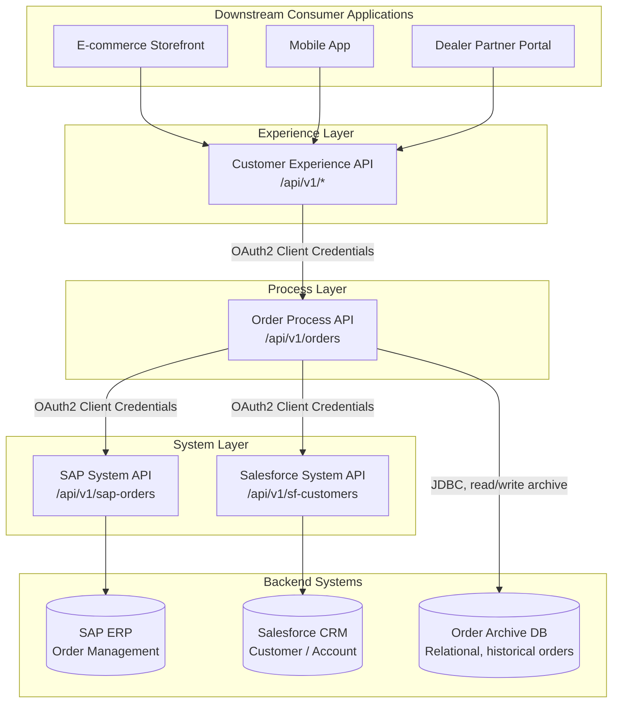

# Enterprise Order Integration Platform

**A MuleSoft API-led connectivity reference architecture** — SAP + Salesforce + a relational order archive, unified behind a governed System/Process/Experience API layering for a fictional multi-channel consumer goods enterprise.

> **Fictional scenario, no proprietary information.** This project models a realistic enterprise integration problem (ERP order data, CRM customer data, multi-channel consumer apps) using an invented company, invented systems, and invented sample data. No proprietary information from any real employer appears anywhere in this repository — see [Fictional Scenario Disclosure](#fictional-scenario-disclosure) below.

## What This Project Demonstrates

This is a flagship project in Raghu Bavaraju's [MuleSoft integration architecture portfolio](https://github.com/raghubavaraju), built to show architect-level design (layering rationale, governance, trade-off documentation) backed by working-example implementation (RAML specs, Mule flows, DataWeave, MUnit), not documentation alone. Its companion project, covering event-driven integration, is at [`event-driven-supply-chain-integration`](https://github.com/raghubavaraju/event-driven-supply-chain-integration).

## Start Here

| If you want to... | Read this |
|---|---|
| Understand the business problem this solves | [`docs/business-problem-statement.md`](docs/business-problem-statement.md) |
| See the full architecture reasoning | [`docs/architecture-overview.md`](docs/architecture-overview.md) |
| See the diagram | [`diagrams/architecture-overview.mmd`](diagrams/architecture-overview.mmd) (rendered below) |
| See *why* specific decisions were made | [`docs/decisions/`](docs/decisions) |
| See the API contracts | [`api-specs/`](api-specs) (RAML) and [`api-contracts/`](api-contracts) (examples) |
| See actual Mule implementation | [`mule-apps/`](mule-apps) |

## Architecture Diagram

## Business Problem (Summary)

Northbridge Consumer Products (fictional) has order data in SAP, customer/account data in Salesforce, and legacy order history in a relational database. Three consumer-facing channels previously integrated point-to-point with each backend. This platform replaces that with a governed API-led layer. Full statement: [`docs/business-problem-statement.md`](docs/business-problem-statement.md).

## Requirements

Functional and nonfunctional requirements — including which NFRs are stated as *design targets* rather than measured production results — are documented in [`docs/requirements.md`](docs/requirements.md).

## API-Led Architecture

Full explanation of the System/Process/Experience layering, why it was chosen over flatter alternatives, and the responsibility boundaries enforced between layers: [`docs/architecture-overview.md`](docs/architecture-overview.md) and [`docs/api-responsibilities-and-boundaries.md`](docs/api-responsibilities-and-boundaries.md).

| API | Layer | Base path |
|---|---|---|
| SAP System API | System | `/api/v1/sap-orders` |
| Salesforce System API | System | `/api/v1/sf-customers` |
| Order Process API | Process | `/api/v1/orders` |
| Customer Experience API | Experience | `/api/v1/orders` (channel-shaped) |

## API Specifications and Example Contracts

- RAML specs (working examples): [`api-specs/`](api-specs)
- Example request/response payloads, fictional sample data: [`api-contracts/`](api-contracts)

## Mule Application Structure

Standard Mule 4 / Maven layout for all four apps, plus a shared global error handler: [`mule-apps/`](mule-apps) (see its own [README](mule-apps/README.md) for the exact folder tree and per-file status).

## DataWeave Transformations

Each app's `src/main/resources/dwl/` folder contains its transformation(s), documented inline: SAP-to-canonical mapping, Salesforce-to-canonical mapping, Order+Customer aggregation, and channel-specific experience shaping.

## Global Error Handling

Shared, reusable error handler mapping backend/protocol errors to a single standardized error response shape across all four APIs: [`mule-apps/common/global-error-handler.xml`](mule-apps/common/global-error-handler.xml).

## Logging and Correlation-ID Strategy

[`docs/logging-and-correlation-id-strategy.md`](docs/logging-and-correlation-id-strategy.md) — correlation ID propagation across all four layers, structured JSON logging, and what is never logged (PII).

## Security Design (OAuth 2.0)

[`docs/security-design-oauth2.md`](docs/security-design-oauth2.md) — grant types per call path, token handling, and policy enforcement at the API Manager layer.

## API Versioning Strategy

[`docs/versioning-strategy.md`](docs/versioning-strategy.md) — URI versioning, breaking-vs-additive change rules, deprecation windows.

## Scalability and Resilience

[`docs/scalability-and-resilience.md`](docs/scalability-and-resilience.md) — independent per-layer scaling, caching, timeouts, retry-with-backoff, circuit breakers, graceful degradation, idempotent order creation.

## MUnit Testing Strategy

[`docs/testing-strategy-munit.md`](docs/testing-strategy-munit.md) — coverage plan per API, plus a fully worked example suite for the Order Process API at [`mule-apps/order-process-api/src/test/munit/order-process-api-test.xml`](mule-apps/order-process-api/src/test/munit/order-process-api-test.xml).

## CI/CD Design

[`docs/ci-cd-design.md`](docs/ci-cd-design.md) — pipeline stages and environment promotion model, with a working build/test/package example at [`ci-cd/github-actions-ci.yml`](ci-cd/github-actions-ci.yml) (deployment stage is explicitly marked pseudocode).

## Architecture Decisions and Trade-Offs

Five ADRs record the non-obvious calls made in this design, including alternatives considered and rejected:

- [ADR-001](docs/decisions/ADR-001-api-led-layering.md) — Why three-layer API-led connectivity, not fewer layers
- [ADR-002](docs/decisions/ADR-002-process-api-owns-db.md) — Why the Process API owns the archive DB connection directly
- [ADR-003](docs/decisions/ADR-003-sync-vs-async-order-creation.md) — Why order creation is synchronous, not event-driven
- [ADR-004](docs/decisions/ADR-004-oauth2-client-credentials.md) — Why OAuth2 Client Credentials for internal system-to-system calls
- [ADR-005](docs/decisions/ADR-005-cloudhub2-deployment-target.md) — Why CloudHub 2.0 is the default deployment target for this scenario

## How to Review This Project

No local setup is required to evaluate the architecture: read this README, then `docs/architecture-overview.md`, then the ADRs. To evaluate the code artifacts specifically:

- **RAML specs** — open directly, or lint with `npx raml-cli validate api-specs/<file>.raml`.
- **DataWeave transformations** — open any `.dwl` file in the DataWeave Playground or Anypoint Studio; each is runnable independently against the sample input shown in its adjacent `api-contracts/*.md` file.
- **Mule flows** — each app under `mule-apps/` is a standard Maven project (`mvn clean package`); running it against live SAP/Salesforce requires real endpoints and credentials, which this repository deliberately does not provide (see [Working Code vs. Documentation](#working-code-vs-pseudocode-vs-documentation-vs-configuration) below).
- **MUnit tests** — `mvn test` inside `mule-apps/order-process-api` runs the worked example suite with all backend calls mocked; no external dependency required.

## Working Code vs. Pseudocode vs. Documentation vs. Configuration

| Category | Where | What it means |
|---|---|---|
| **Working example** | `api-specs/*.raml`, `mule-apps/*/src/main/mule/*.xml`, `mule-apps/*/src/main/resources/dwl/*.dwl`, `mule-apps/common/global-error-handler.xml`, `mule-apps/order-process-api/src/test/munit/order-process-api-test.xml`, `ci-cd/github-actions-ci.yml` (build/test/package stages) | Syntactically valid, intended to run in a real Mule/Maven environment against the fictional backends when mocked or stubbed. Never deployed or run against any real system. |
| **Pseudocode** | `ci-cd/github-actions-ci.yml` (deployment stage, commented out), MUnit mock setup blocks marked with an inline note | Illustrates intended structure/logic; not guaranteed to run as-is, typically because doing so would require real credentials or infrastructure. |
| **Architecture documentation** | Everything under `docs/`, this README, `api-contracts/*.md` | Explains reasoning, requirements, and trade-offs; not executable. |
| **Configuration placeholder** | `mule-apps/*/src/main/resources/config/config-placeholder.yaml`, `mule-artifact.json` `secureProperties` entries | Non-functional example values only (e.g., `${secure::sap.client.secret}`). No real credential of any kind appears anywhere in this project. |

## Fictional Scenario Disclosure

Company name, system names, and all sample data in this project are invented. No proprietary information from any real employer appears anywhere in this repository or in any other repository in this portfolio.
